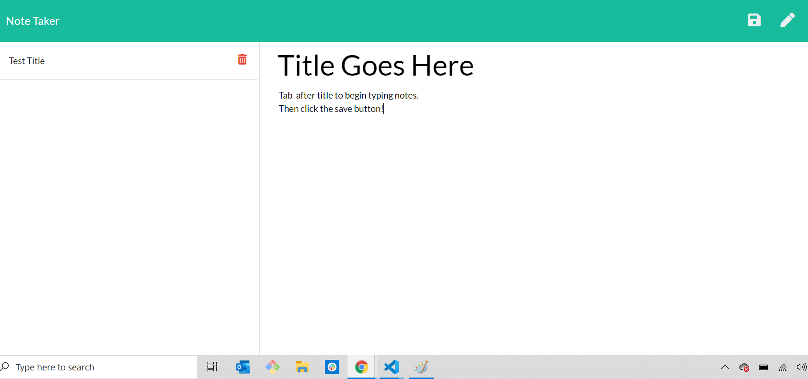

 
#   
 
  # **Project** Note Taker
  
  ##  **_Live Link_** 
  * https://pure-sea-28508.herokuapp.com/
  
  ##  **Table of Contents**
  * Description
  * Technology Stack
  * Installation
  * Usage
  * Contributors
  * Contact
  
  ##  **Description**
  Note-Taker is an application that allows a user to create a notes file using Node Express
 

 
 

  ## **Installation**
  JSON Package Included
 
  ## **Technology Stack**
 HTML, CSS, JavaScript, jQuery, Node.Js, Node Express

  ##  **Usage**

  #### **Contributors** 
* @git-theresa

#### **Contact**
* :computer:  GitHub: [https://github.com/git-theresa](https://github.com/git-theresa) 
* :e-mail:  Email: [t.eatherly@gmail.com](t.eatherly@gmail.com)
* :earth_americas:  LinkedIn: [https://www.linkedin.com/in/theresa-eatherly-4362b14a/](https://www.linkedin.com/in/theresa-eatherly-4362b14a/)

